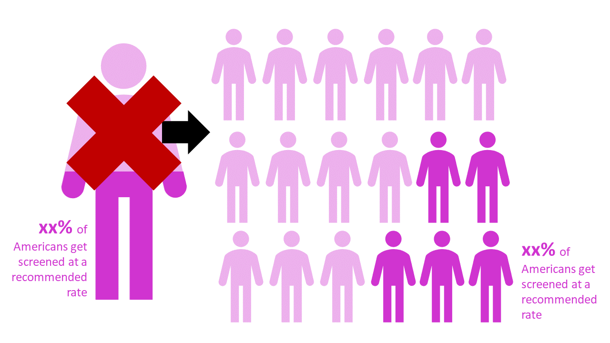
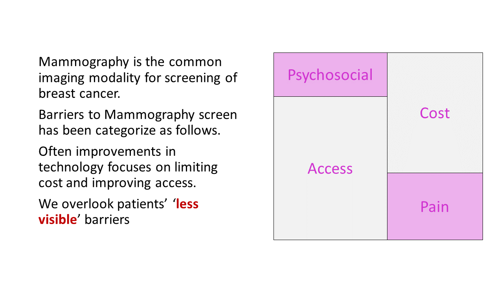
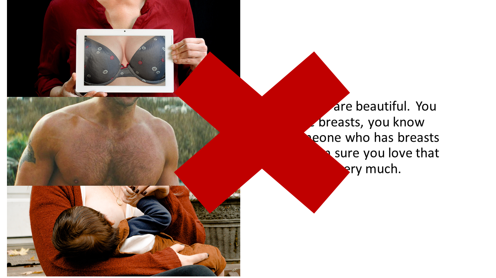
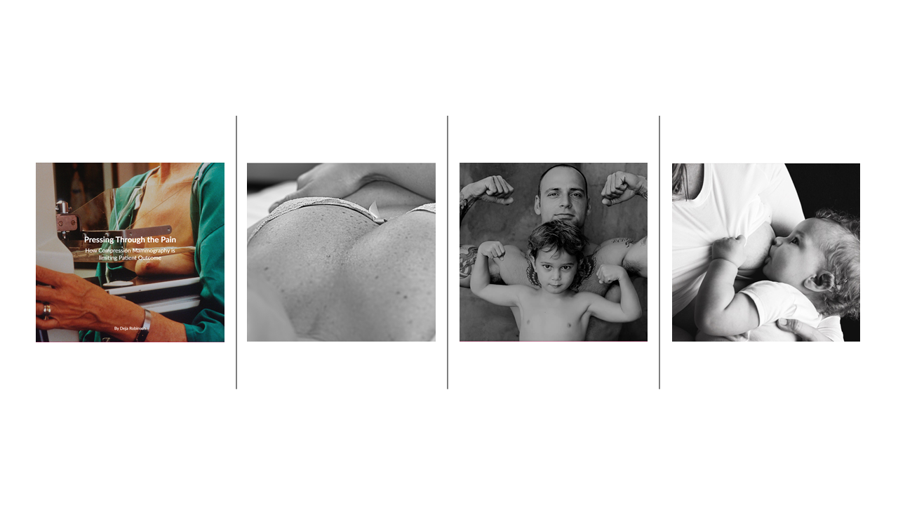

# Part Two

# Wireframes 
From my part one submission, I worked created actual sketches of my datavizulizations, rather than just putting in a placeholder for a bar graph. I also explored with color and mood photos for this presentation. 
Here is my updated storyboad I used for my user feedback rounds.

<object data="https://www.docdroid.net/Omm22tV/userfeedback.pdf" type="application/pdf" width="900px" height="700px">
    <embed src="https://www.docdroid.net/Omm22tV/userfeedback.pdf">
        
This browser does not support PDFs. Please download the PDF to view it: <a href="https://www.docdroid.net/pGSFWHF/wireframe.pdf">Download PDF</a>.

    </embed>
</object>

# User Research Protocol 

## Target Audience you hope to reach. 
My goal is to target young individuals passionate about the improvement of healthcare. This could include healthcare innovators and health care providers.   

## Approach to indentifying individuals to interview 
Approach individuals who are working in healthcare or aligning themselves to enter the healcare industry. 

## Interview Script 

Hello! My name is Deja and I'm creating a short interactive document about patient desired improvements in breast imaging. I currently have a powerpoint presentation, however this is just a wireframe for a scrollable interactive site such as this. *Display an example Shorthand site* Is now a bad time to speak about possible improvements I could make in this presentation?

Also, is it alright that I record you? 

I will only be using characteristics you give me to depict you in your interview for my report such as age, gender, and career. 

Let's get started! Per slide, I will ask you three questions and at the end we will have two wrap up questions.

Per Slide: 
1. Is anything causing confusion on this slide?
2. What questions do you have? How might I address them on this slide?
3. Is the data vizulation aestheticly pleaseing? 

After Entire Presentation: 
1. What is missing from this presentation? 
2. Who do you think this site is for? 
3. Any other remarks? 

## Interview Findings
I've included the quptes 

A: Female, 25, Speciality: Brain Imaging, Research Adolecent Mental Health, Card Carring Feminist

"I like that you're using includive language here. It's very important to address that population- espically when you start your presentation saying that everyone has breasts....everyone. But, if you chose to be inclusive in your language be sure to be inclusinve in your data selection as well. Did you use and trans specific papers?"

"I see this site aligned for an entry level engineering or business student, trying to discover a pain point so they can deliver a solution rather than an idividual trying to get information on how thier firt imaging session would be like and why they're going throuhg with it," 

B: Male, 25, Speciality: Brain Imaging, Biomedical Research.

"Compression doesn't make sense for imaging at all. I don't have to squeeze people's brains to get a clear imagge of what's going on in there...  Is it xray? I need more information on why this is a standard procedure- not just doctors refusing to adapt new modalities because mammograms are just what they do...you know? Pretty much I'm saying I want to know why doctors are doing this, why compression is specificly used for breast imaging and nothing else,"

"I think this site is for women...and men who have women in their lives and are curious about keeping thier health," 

C: Female, 23, Speciality: CMU Biomedical Graduate Student. 

"This site is for people who are empathetic, and truly care about people's emotions during thier healthcare experience...and also what follows them home when they're done," 

"I wish there was more information about compression. The image of the boobs being squished is uncomfortable...and I hate that, but I understand why you chose to depict it like that because I didn't know that's how it happened....But I'm a woman and I'm going to have to deal with that and...i'm not excited for it. But as an engineer, I want to know why we are using that technology," 

# Revised wireframes

I realized that I need to narrow my scope for my target audience and put in more technical explanation on how compression is used to gain clearer images. That will be included in text form as I redisgn my story for the target of young healthcare enthusists. 
The majority of my visable edits were made from smaller slide to slide comments. An overall comment I found was that I was using inclusive terms, such as female identifying/assigned female at birth- however I've neglected to use sources that actually included transgender individuals. To solve this, I've found a few articles relating to this population and intend to use them in my final presentation. 

My additional refrences that will be included: 
>Incident of breast cancer in a cohort of 5,135 transgender veterans
> Breast Care in the Transgender Individual
> Breast Imaging in the Transgender Patient 

All my partifipants were unhappy with the screening rate slide, displaying a person icon. I've modified it to something like this:

	

	

'Less visable barriers' will be changed to 'less considered barriers' 

	

My Introduction Photots were distracting and confused to a few of my interviewers, so they've been modified. 

[BACK TO HOME](/README.md)
