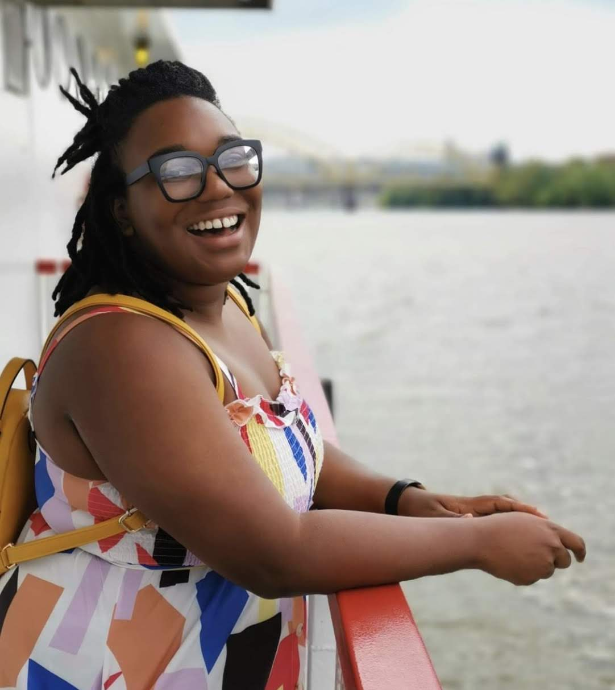

# Welcome!
Public Portfolio for Telling Stories with Data Course at CMU, Fall 2020

# About Me

  
 

My name is Deja Robinson (she/her) and I am currently pursuing a dual masters degrees at Carnegie Mellon University for Biomedical Engineering and Engineering & Technology Innovation Management. I want to save lives in my career, and I'm positiong myself to earn a role in Medical Device Product Management for a leading medical device company. 

A favorite quote of mine that I try to apply to my life and daily actions by Tonie Morrison:
> As you enter positions of trust and power, 
> dream a little before you think.

I graduate this year in May (YES!), and I will be starting my career as a Field Engineer/Medical Device Sales Specialist for GE Healthcare in June. 

When I'm not in class or doing homework, I'm very passionate about hosting game nights, playing my instuments, and starting my secondary career as a DJ. My father gifted me his setup, I have no idea how to use it so- anyone reading if you have any suggestions I'll take them!

>Pictures to come of my instruments and favorites games :) 

# What I hope to learn... 
I am enrolled in the course to better alingn myself to my career goals of becoming a product manager. Data has power if articulated correcty and I hope to learn how to create convinving narritves about the data I will encounter in my career.

# Portfolio
Here is where all my beautiful creations will live! 
