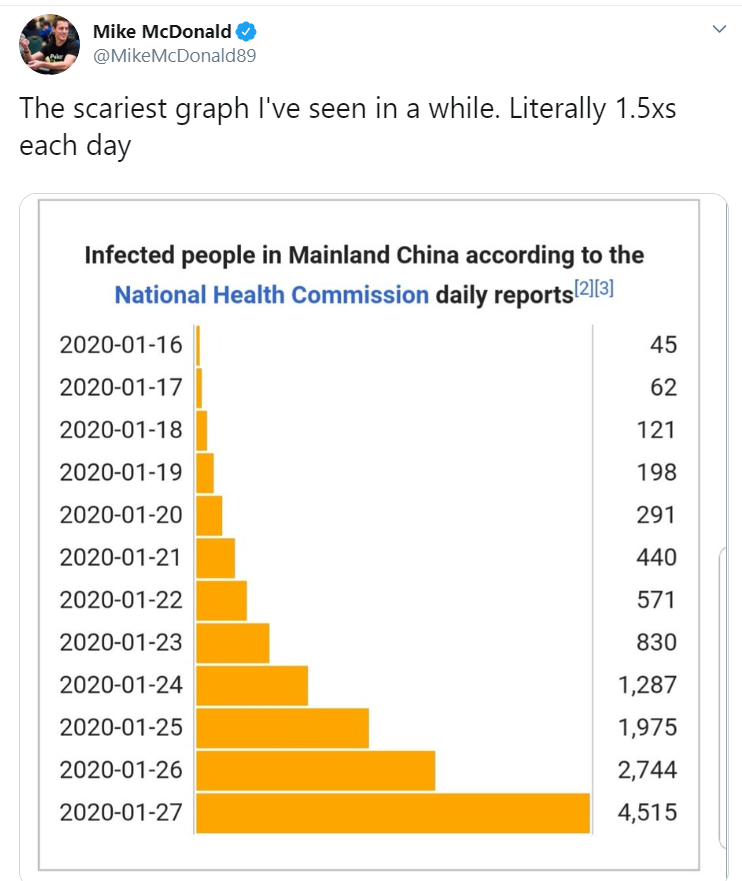
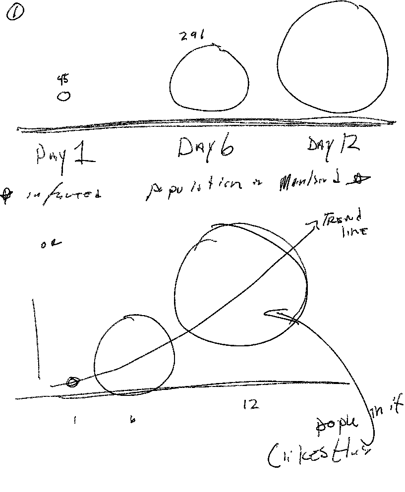
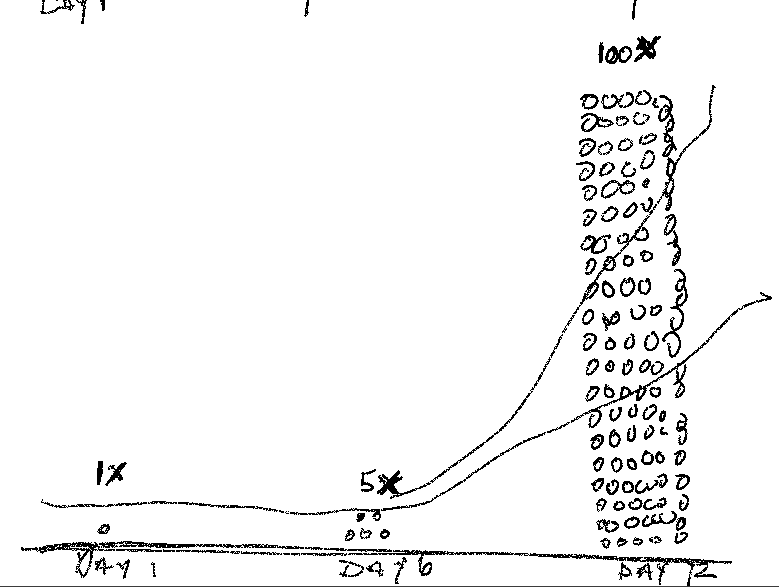
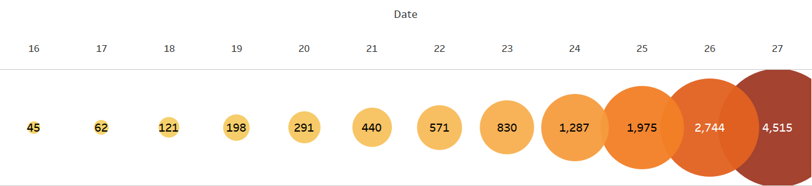
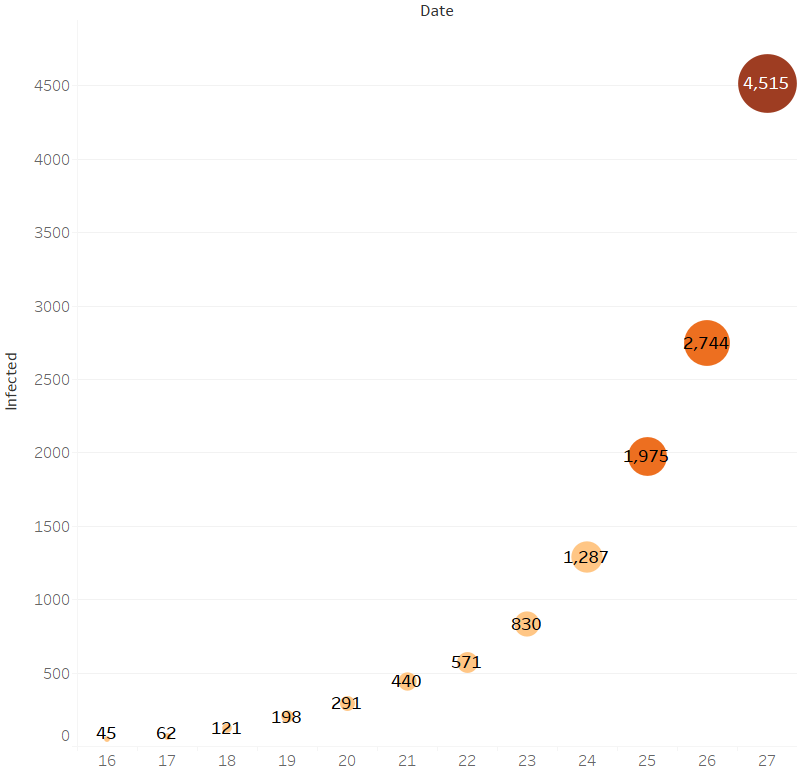
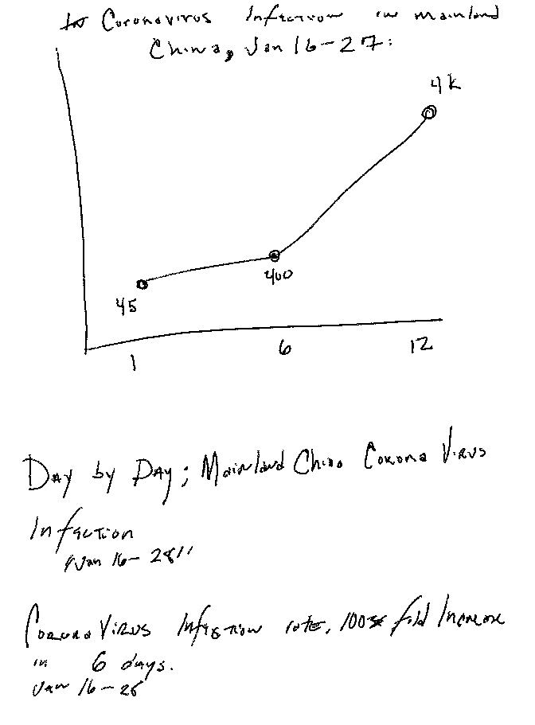

## Critique By Design, Data Viz Assignment

Here's the orginal graph I found that I didn't think was reaching its full graph potiential. 
-

Here are my imediate sketches in response. 

sketch 1

sketch 2

Sketch 3

Interviews with Passersby 

Sketch 5 

Sketch 6

Final Product

<iframe title="Coronavirus Infection, 100 fold Increase in 12 Days" aria-label="Interactive line chart" id="datawrapper-chart-X4aBG" src="//datawrapper.dwcdn.net/X4aBG/1/" scrolling="no" frameborder="0" style="width: 0; min-width: 100% !important; border: none;" height="400"></iframe>

[BACK TO HOME](/README.md)
