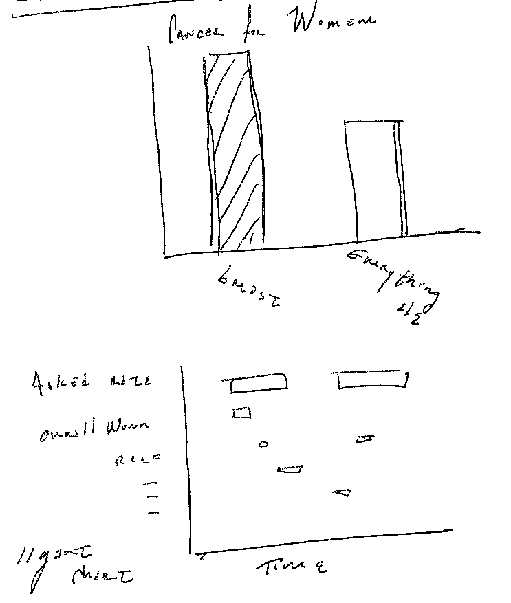
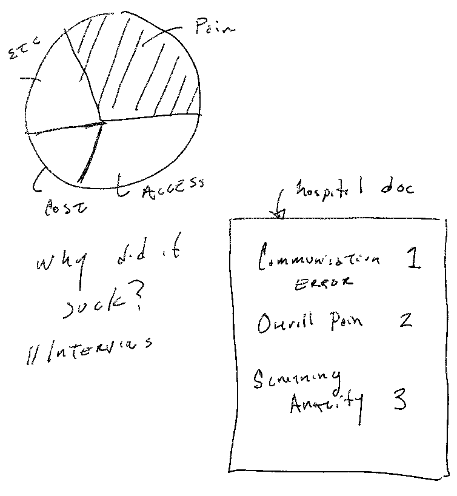

# Final Project Wireframe 

My goal is to create an interactive site that will allow readers to learn more about the current state of breast imaging technology and display the gaps between pratient needs and what is being satisfied.
Breast Imaging in painful in the current state, which is often overlooked by our current healthcare system. 
Exposing these gaps can insipre readers to act today, educate thier loved ones, and consider dontating to a chartity that first supports patients' needs. 

<object data="https://www.docdroid.net/pGSFWHF/wireframe.pdf" type="application/pdf" width="900px" height="700px">
    <embed src="https://www.docdroid.net/pGSFWHF/wireframe.pdf">
        
This browser does not support PDFs. Please download the PDF to view it: <a href="https://www.docdroid.net/pGSFWHF/wireframe.pdf">Download PDF</a>.

    </embed>
</object>

# Inital Sketches 

I've decided to use common visulizations that would be accessible for my audience. I still have to do in depth digestion of my selected data sources to find more options for visulizations. 

# Data Sources 

I've been using academic papers to find the right data to support my narritive. I've selected the following articles and sources. 

>Barries to Breast Cancer Sceening and Coping Stategies in Korean American Woman; Journal of Transcultural Nursing

>Brawling Over Mammography; Science AAAS

>The Incidence of Fatal Breast Cancer Measures the Increased Effectiveness of Therapy in Women Participating in Mammography Screening; Cancer

>Growing concer following compression mammography; learning from errors

>Breast Canccer Screening Among Dominican Latinas: A Closer Look at Fatalism and Other Social and Cultural Factors; Health Education & Behavior 

>'It's Easier Said Than Done' Perspectives on Mammography from Women with INtellectual Disabilities; Annals of Family Medicine

>Newer and Experimental Breast Imaging Tests; American Cancer Society 

>Client and pactitioner perspective on the screening mammography experience; Wiley 

>Prospective Stidy of Factors Predicting Adherence to Survellance Mammography in oOmen Treated for Breast Cancer; Journal of Clinical Oncology

Here's a link to the [documents](https://drive.google.com/drive/folders/1ntjsFZNc2vz-7FywFQ2_oNp1egFd9Q0o?usp=sharing) I will be using for my final presentation.

[BACK TO HOME](/README.md)
